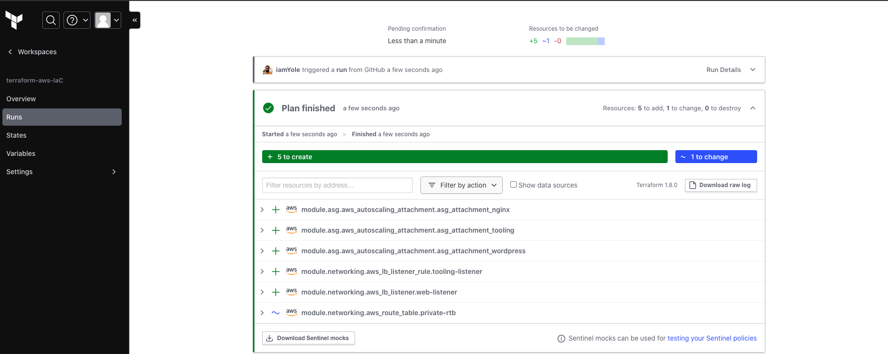

<!-- # Hi there 👋 -->

## About Me

I am a certified DevOps engineer with a passion for building scalable and efficient systems. My expertise lies in Amazon Web Services (AWS), Docker, Kubernetes, Python, and Machine Learning. With a strong foundation in both software development and operations, I excel in creating automated pipelines, optimizing infrastructure, and deploying resilient applications.

## Skills

- **DevOps**: Certified DevOps engineer experienced in implementing continuous integration, continuous deployment (CI/CD) pipelines, infrastructure as code (IaC), and automation.
- **Amazon Web Service (AWS)**: Proficient in configuring, managing, and troubleshooting AWS environments for enterprise applications.
- **Containerization**: Skilled in Docker containerization to package, distribute, and run applications in isolated environments.
- **Kubernetes**: Experienced in deploying and managing containerized applications at scale using Kubernetes for orchestration.
- **Python**: Proficient in Python programming for scripting, automation, data analysis, and machine learning.
- **Machine Learning**: Knowledgeable in machine learning concepts, algorithms, and frameworks for predictive analytics and data-driven decision-making.

<h3 align="left">Languages and Tools:</h3>

                       

## DevOps Projects

### End to End Continous Integration (CI) using JENKINS | ANSIBLE | ARTIFACTORY | SONARQUBE | PHP

In this project, we will be taking a deeper look at Continuous Integration in practice. Here, will use several CI softwares like Jenkins, Ansible, SonarQube, etc to drive this implementation.

[Project Repository](https://github.com/iamYole/DIO-DevOps-Projects/blob/main/Project%2018%20-%20End%20to%20End%20Continous%20Intergration%20Project/README.md)

### Infrastructure as a Code (IaC) using Packer | Terraform | Terraform Cloud | Ansible in AWS

In this project, we wil be introduce a concept called Infrastructure as a Code (IaC) to manage and provision cloud resources. Iac is all about using code rather than manual processes to create and provision cloud infrastructures. We will also dive into Packer to create immutable resources, Terraform Cloud and use Ansible to carry out further configurations after the resources have been created.

[Project Repository](https://github.com/iamYole/DIO-DevOps-Projects/blob/main/Project%2016%20-%20Infrastructure%20as%20a%20Code%20using%20Terraform/README.md)

<!-- ### Project Name 2

Brief description of the project.

[Project 2 Repository](https://github.com/yourusername/project-2) -->

## Machine Learning and AI Projects

### Image Classification Using Pytorch

In this project, I improved the prediction accuracy of an existing machine learning model created by [FAHAD MEHFOOZ](https://www.kaggle.com/code/fahadmehfoooz/pneumonia-classification-using-pytorch/notebook). I was able to archive a 7.05% improvement in the model's accuracy by tuning few hyper parameters, introducing a validation dataset to guide against overfitting, etc.

[Project Report](https://github.com/iamYole/iamyole.github.io/blob/main/documents/Poster.pdf) |
[Project Repository](https://github.com/yourusername/project-1)

### Population Growth vs. Energy Consumption

In this project, I explored the relationship (if any) between population growth of a country and it's energy consumption. It was surprising to find out that there is somewhat a negative relationship between Population Growth and Energy Consumption worldwide.

[View Project Repository in Kaggle](https://www.kaggle.com/code/gideonovuzorie/population-growth-vs-energy-consumption)

&nbsp;

## Contact Me

Feel free to reach out to me via [email](mailto:gideonovuzorie@gmail.com) or connect with me on  

