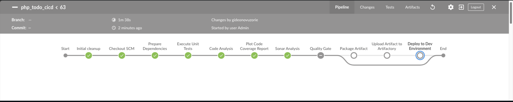
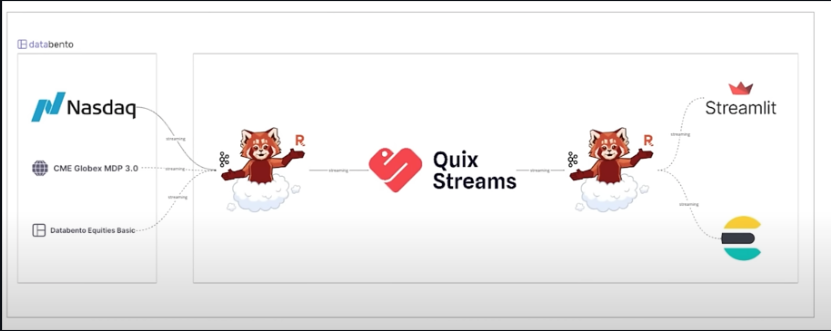
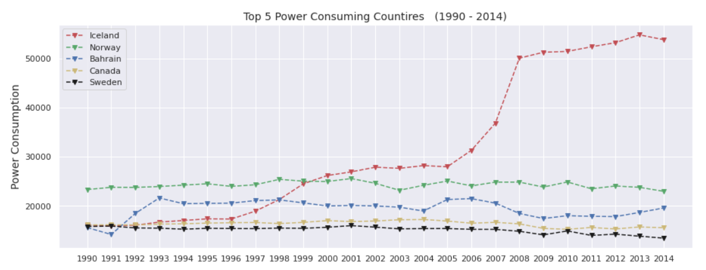

<!-- # Hi there 👋 -->

## 👨‍💻 About Me

A Data Engineer with a strong focus on building scalable, reliable, and high-performance data pipelines/systems. My expertise spans **data modeling**, **ETL/ELT pipeline development**, and **big data processing** using tools such as **Apache Spark**, **Kafka**, **Airflow**, and **Databricks**.  
Skilled in **Python**, **SQL**, and distributed computing frameworks, I excel at designing **end-to-end data workflows** that transform raw data into actionable insights.  

With hands-on experience across **cloud platforms** like **AWS**, **GCP**, and **Azure**, I specialize in optimizing **data storage**, **query performance**, and **streaming architectures** to support both **real-time** and **batch processing** needs.  I am passionate about creating **robust data infrastructures** that empower **analytics**, **machine learning**, and **business intelligence** solutions.  

By combining software engineering principles with modern data engineering practices, I deliver efficient, automated, and resilient systems that enable organizations to make data-driven decisions at scale.

## 🛠️ Skills  

### Programming & Scripting  
- **Python**: Data transformation, automation, pipeline development  
- **SQL**: Advanced querying, optimization, data modeling  

### Data Processing & Orchestration  
- **Apache Spark**: Distributed batch processing  
- **Apache Kafka**: Real-time data streaming  
- **Apache Airflow**: Workflow orchestration and scheduling  
- **Databricks**: Unified analytics and machine learning platform  

### Cloud Platforms & Infrastructure  
- **AWS**: S3, Redshift, Glue, EMR, ...  
- **GCP**: BigQuery, Dataflow, Pub/Sub  
- **Azure**: Data Factory, Synapse Analytics  

### Databases & Storage  
- **Relational Databases**: PostgreSQL, MySQL  
- **NoSQL Databases**: MongoDB  
- **Data Warehousing**: Snowflake, Redshift, BigQuery  
- **Data Lakes**: Amazon S3, Google Cloud Storage  

### Containerization & Orchestration  
- **Docker**: Containerization for consistent environments  
- **Kubernetes**: Deploying and managing containerized applications at scale  

### Data Visualization & Analytics  
- **Looker**
- **Power BI**  
- **Tableau**

## DevOps Projects

### End to End Machine Learning Fraud Detection Solution using Kafka | Airflow |Apache Spark | SCIKIT | MLFlow 

A machine learning pipeline for detecting fraudulent transactions using real-time data processing and model orchestration.

This project demonstrates an end-to-end MLOps workflow, from data ingestion and preprocessing to model training, tuning, and deployment. It leverages both batch and streaming components to provide scalable and efficient fraud detection.

[Project Repository](https://github.com/iamYole/End-to-End_ML_Fraud_Detection_Solution.git)

### Realtime Stock Anomaly Detection using Kafka | Quix Streams | Elastic Search | SKLearn

This project will be in four (4) Parts. We will start with an introduction to Infrastructure as a Code (IaC) to manage and provision cloud resources. Iac is all about using code rather than manual processes to create and provision cloud infrastructures. We will also dive into Packer to create immutable resources, Terraform Cloud and use Ansible to carry out further configurations after the resources have been created.

[Project Repository](https://github.com/iamYole/DIO-DevOps-Projects/blob/main/Project%2016%20-%20Infrastructure%20as%20a%20Code%20using%20Terraform/README.md)

<!-- ### Project Name 2

Brief description of the project.

[Project 2 Repository](https://github.com/yourusername/project-2) -->

### Image Classification Using Pytorch

In this project, I improved the prediction accuracy of an existing machine learning model created by [FAHAD MEHFOOZ](https://www.kaggle.com/code/fahadmehfoooz/pneumonia-classification-using-pytorch/notebook). I was able to archive a 7.05% improvement in the model's accuracy by tuning few hyper parameters, introducing a validation dataset to guide against overfitting, etc.

[Project Report](https://github.com/iamYole/iamyole.github.io/blob/main/documents/Poster.pdf) |
[Project Repository](https://github.com/yourusername/project-1)

### Population Growth vs. Energy Consumption

In this project, I explored the relationship (if any) between population growth of a country and it's energy consumption. It was surprising to find out that there is somewhat a negative relationship between Population Growth and Energy Consumption worldwide.

[View Project Repository in Kaggle](https://www.kaggle.com/code/gideonovuzorie/population-growth-vs-energy-consumption)

&nbsp;

## Contact Me

Feel free to reach out to me via [email](mailto:gideonovuzorie@gmail.com) or connect with me on  

